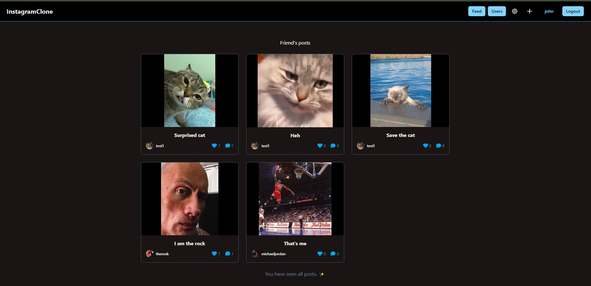
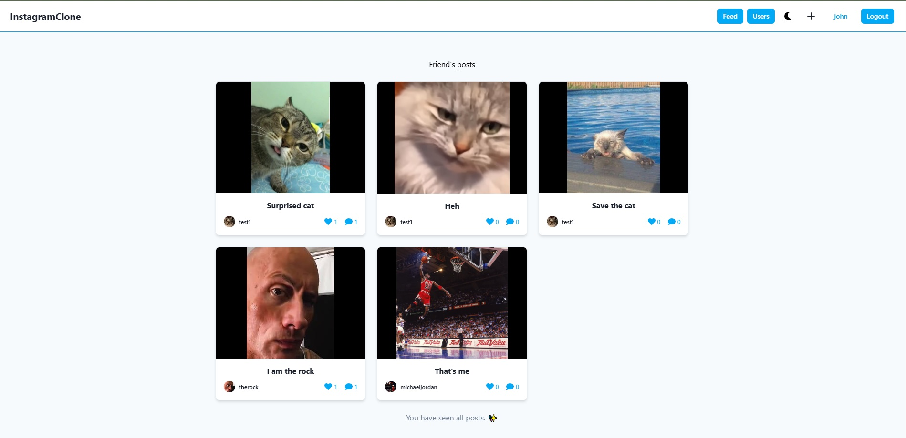
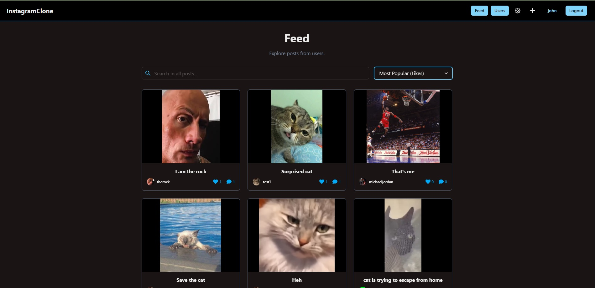
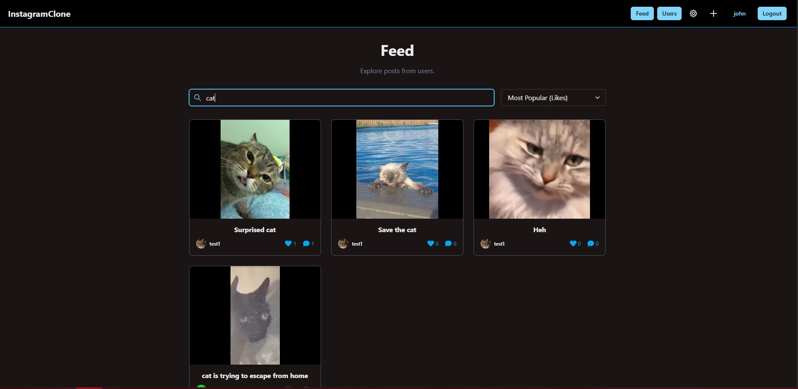
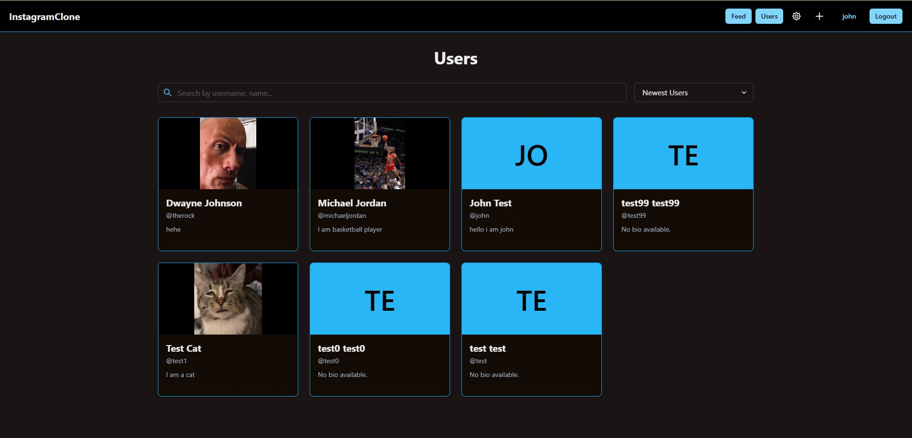
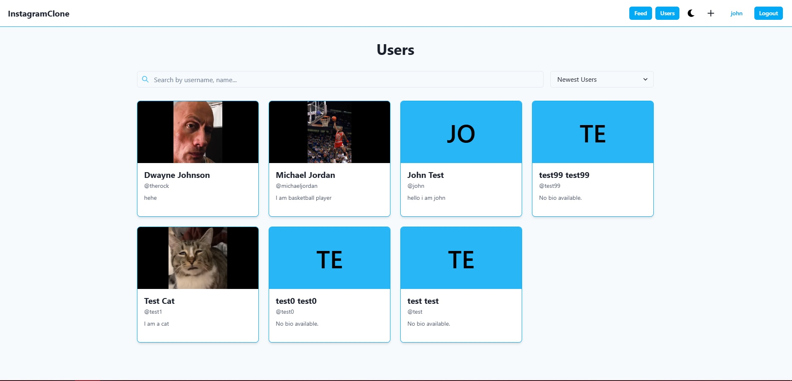
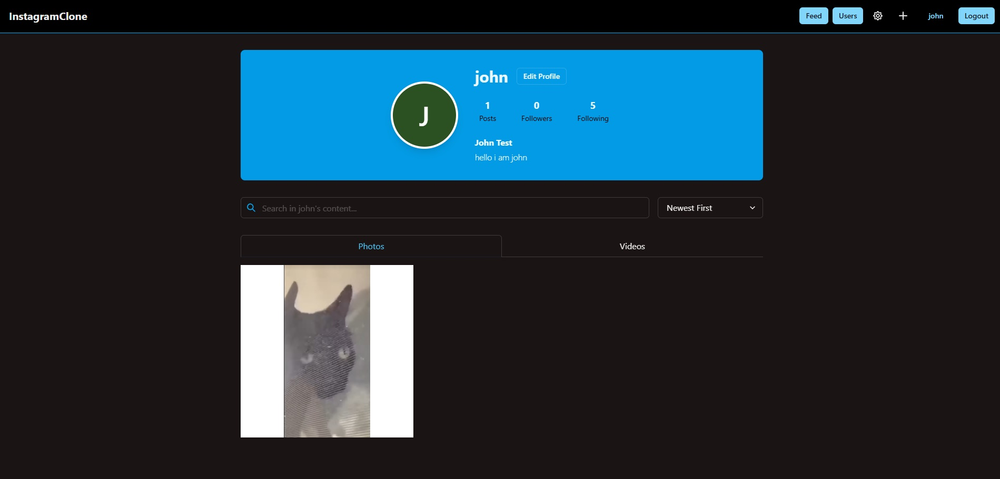
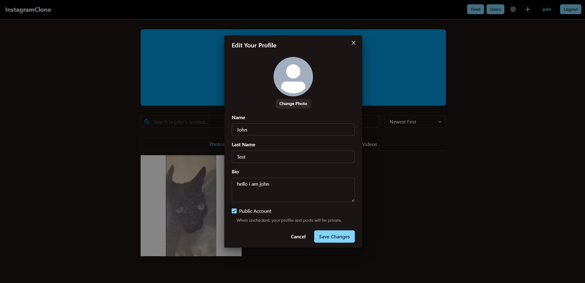
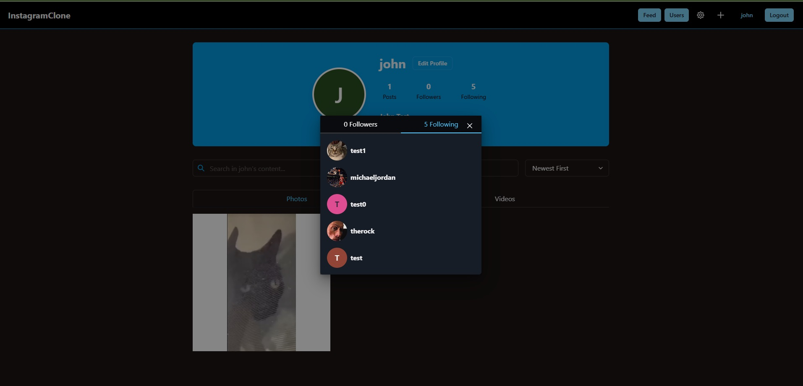

# Instagram Clone Frontend

This project is a front-end clone of Instagram, built with React. It aims to replicate the core features and user interface of the popular social media platform.

## Features

*   **User Authentication:** Sign up, sign in, and sign out.
*   **Post Management:** Create, view, and delete posts.
*   **Feed:** View a feed of posts from users you follow.
*   **Profiles:** View user profiles with their posts and follower/following counts.
*   **Follow/Unfollow:** Follow and unfollow other users.
*   **Likes and Comments:** Like and comment on posts.

## Technologies Used

*   **React:** A JavaScript library for building user interfaces.
*   **Vite:** A fast build tool for modern web projects.
*   **React Router:** For handling routing within the application.
*   **Chakra UI:** A component library for building accessible and responsive user interfaces.
*   **Axios:** A promise-based HTTP client for making requests to the backend API.

## Getting Started

To get a local copy up and running, follow these simple steps.

### Prerequisites

*   Node.js and npm installed on your machine.

### Installation

1.  Clone the repo
    ```sh
    git clone https://github.com/your_username/instagram-clone-frontend.git
    ```
2.  Install NPM packages
    ```sh
    npm install
    ```
3.  Start the development server
    ```sh
    npm run dev
    ```

The application will be available at `http://localhost:5173`.

## Screenshots

| HomePage | HomePageLight | FeedPage |
| --- | --- | --- |
|  |  |  |

| FeedPageSearch | UserListPage | UserListPageLight |
| --- | --- | --- |
|  |  |  |

| ProfilePage | EditProfileModal | FollowModal |
| --- | --- | --- |
|  |  |  |
